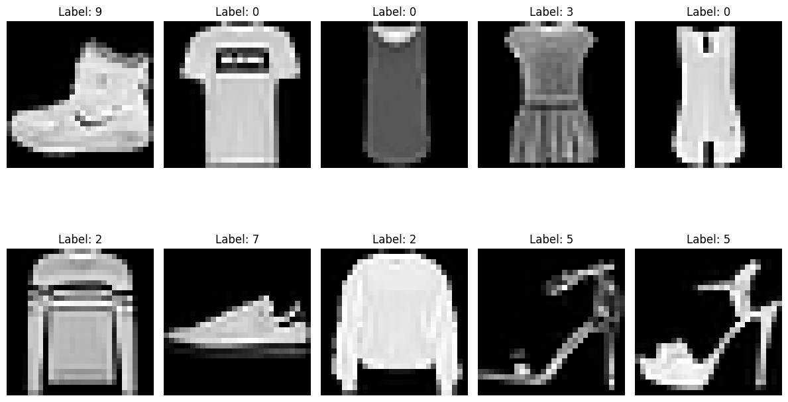

# Fashion MNIST Veri Seti Üzerinde Model Performansı Değerlendirmesi 👗👠

Bu notebook'ta Fashion MNIST veri seti üzerinde farklı makine öğrenimi modellerinin performansını değerlendirdim. Fashion MNIST, farklı giyim eşyalarını içeren bir veri setidir.

---

## Adım 1: Veri Seti Yükleme ve Görselleştirme 📸

Fashion MNIST veri seti, eğitim ve test seti olarak ikiye ayrılmıştır:

- **Eğitim veri seti boyutu:** (60000, 28, 28)
- **Test veri seti boyutu:** (10000, 28, 28)
- **Görüntü boyutu:** 28 x 28

İlk 10 örnek görselleştirilmiştir:

---

## Adım 2: Veri Ön İşleme 📏

Veri seti normalize edilmiştir (0-1 arası değerler).

---

## Adım 3: Model Performansı 🚀

### Sonuçlar

Farklı makine öğrenimi modelleri kullanarak eğitim yapıp performanslarını değerlendirdik. İşte elde ettiğimiz sonuçlar:

| Model                 | Doğruluk | Hassasiyet | Duyarlılık | F1-Skor | AUC      |
|-----------------------|----------|------------|------------|---------|----------|
| Logistic Regression   | 0.8508   | 0.8500     | 0.8508     | 0.8501  | 0.9845   |
| LightGBM              | 0.8994   | 0.8990     | 0.8994     | 0.8989  | 0.9932   |
| KNN                   | 0.8528   | 0.8551     | 0.8528     | 0.8514  | 0.9690   |
| Decision Tree         | 0.8057   | 0.8083     | 0.8057     | 0.8057  | 0.9597   |
| Random Forest         | 0.8812   | 0.8807     | 0.8812     | 0.8798  | 0.9908   |

---
Her model için Doğruluk, Hassasiyet, Geri Çağırma, F1 Puanı ve AUC metriklerini hesapladık ve performanslarını karşılaştırdık. LightGBM modeli Fashion MNIST veri setinde en yüksek doğruluğu ve F1 Skorunu elde ederken, Decision Tree modeli değerlendirilen modeller arasında en düşük puanları elde etti.

- Colab Link : https://colab.research.google.com/drive/1ChBKhyV4HNSMUJeUI6ulFODuxxjgoNGh?usp=sharing

# English Version

In this notebook, I evaluated the performance of various machine learning models on the Fashion MNIST dataset, which consists of different clothing items.

---

### Step 1: Data Loading and Visualization 📸

The Fashion MNIST dataset is divided into training and test sets:

- **Training set size:** (60000, 28, 28)
- **Test set size:** (10000, 28, 28)
- **Image size:** 28 x 28

The first 10 examples were visualized:

---

### Step 2: Data Preprocessing 📏

The dataset was normalized (values between 0 and 1).

---

### Step 3: Model Performance 🚀

We trained different machine learning models and evaluated their performances. Here are the results we obtained:

| Model                 | Accuracy | Precision | Recall  | F1 Score | AUC      |
|-----------------------|----------|-----------|---------|----------|----------|
| Logistic Regression   | 0.8508   | 0.8500    | 0.8508  | 0.8501   | 0.9845   |
| LightGBM              | 0.8994   | 0.8990    | 0.8994  | 0.8989   | 0.9932   |
| KNN                   | 0.8528   | 0.8551    | 0.8528  | 0.8514   | 0.9690   |
| Decision Tree         | 0.8057   | 0.8083    | 0.8057  | 0.8057   | 0.9597   |
| Random Forest         | 0.8812   | 0.8807    | 0.8812  | 0.8798   | 0.9908   |

---

We calculated Accuracy, Precision, Recall, F1 Score, and AUC metrics for each model and compared their performances. The LightGBM model achieved the highest accuracy and F1 Score on the Fashion MNIST dataset, while the Decision Tree model had the lowest scores among the evaluated models.

